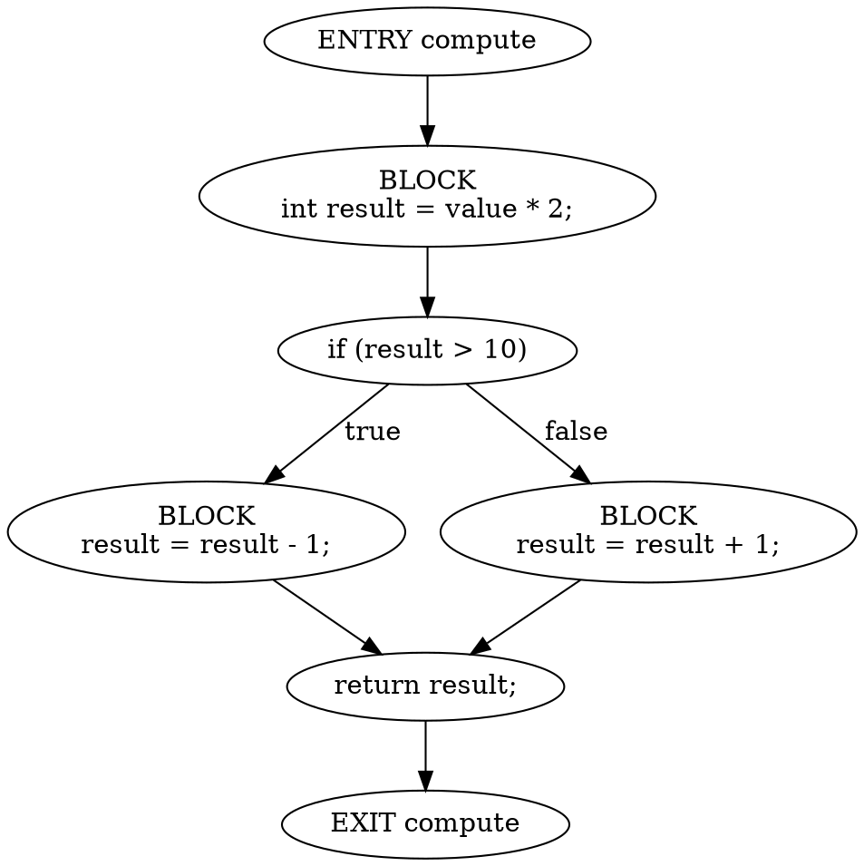

# Java Control Flow Graph Generator

A small educational Java project that parses Java source files and builds simple method-level Control Flow Graphs (CFGs). The generated graphs are exported as Graphviz DOT text and printed to the console.

## Project Status

Work in progress.

This is a working educational version. It handles a practical subset of Java statements and is intentionally not a complete Java CFG implementation.

## Technologies

- Java 17
- Maven
- JavaParser
- Graphviz DOT format

## Features Implemented

- Parse a Java source file with JavaParser
- Extract method declarations
- Build one CFG per method
- Add method entry and exit nodes
- Group consecutive expression statements into simple basic-block nodes
- Support common statements:
  - expression statements
  - return statements
  - `if` / `else` statements
  - `while`, `for`, enhanced `for`, and `do while` loops
  - loop `break` and `continue`
  - `switch` statements
  - basic `try` / `catch` / `finally`
- Export CFGs as Graphviz DOT
- Print DOT output to the console
- Optionally write one `.dot` file per method
- Unit tests for core CFG construction behavior
- Include a runnable example in `examples/TestInput.java`

## Planned Features

- Support for `throw`, labeled `break` / `continue`, and complex exception flow
- More complete `switch` fall-through modeling
- More Java constructs such as lambdas, synchronized blocks, and pattern matching
- Better DOT styling for visual readability
- Command-line options for filtering methods and output formats

## How to Build

```bash
mvn compile
```

## How to Run

Run the included example:

```bash
mvn exec:java
```

Run against a specific Java file:

```bash
mvn exec:java -Dexec.args="examples/TestInput.java"
```

Run against a specific Java file and write DOT files to a directory:

```bash
mvn exec:java -Dexec.args="examples/TestInput.java target/dot-output"
```

On PowerShell, use this quoting style:

```powershell
mvn exec:java '-Dexec.args=examples/TestInput.java target/dot-output'
```

## Example Output

The exact node ids may change as the implementation evolves, but the output looks like this:



You can paste the DOT output into Graphviz tools to visualize the graph.

## Limitations

- This project does not claim full Java control-flow support.
- Basic blocks are simple groupings of consecutive expression statements, not compiler-grade basic blocks.
- Exception flow is approximate. `try` / `catch` / `finally` is represented, but precise thrown-exception paths are not.
- `throw`, labeled `break` / `continue`, lambdas, and many advanced constructs are not handled yet.
- Loop and switch handling is basic and best suited for small examples.
