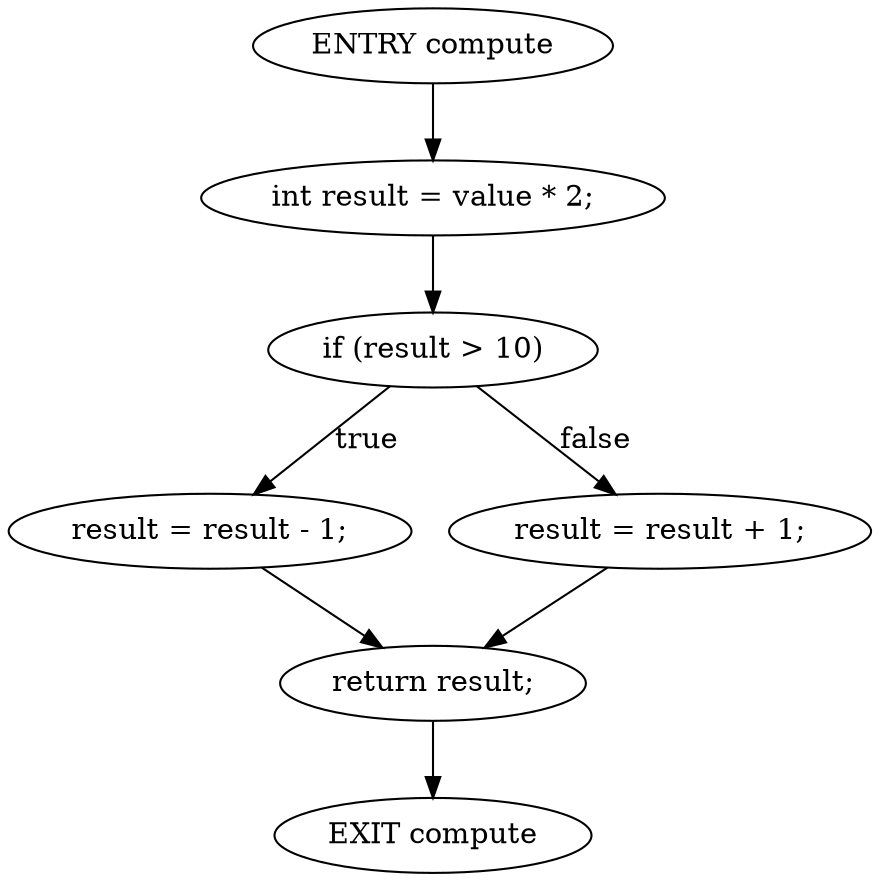

# Java Control Flow Graph Generator

A small educational Java project that parses Java source files and builds simple method-level Control Flow Graphs (CFGs). The generated graphs are exported as Graphviz DOT text and printed to the console.

## Project Status

Work in progress.

This is a first working version. It handles a practical subset of Java statements and is intentionally not a complete Java CFG implementation.

## Technologies

- Java 17
- Maven
- JavaParser
- Graphviz DOT format

## Features Implemented

- Parse a Java source file with JavaParser
- Extract method declarations
- Build one CFG per method
- Add method entry and exit nodes
- Support simple statements:
  - expression statements
  - return statements
  - `if` / `else` statements
  - simple `while` loops
- Export CFGs as Graphviz DOT
- Print DOT output to the console
- Include a runnable example in `examples/TestInput.java`

## Planned Features

- Better loop modeling for `break` and `continue`
- Support for `for`, `do while`, `switch`, `try/catch`, and enhanced Java constructs
- More precise basic block generation
- Unit tests for CFG construction
- Optional writing of DOT output to files

## How to Build

```bash
mvn compile
```

## How to Run

Run the included example:

```bash
mvn exec:java
```

Run against a specific Java file:

```bash
mvn exec:java -Dexec.args="examples/TestInput.java"
```

## Example Output

The exact node ids may change as the implementation evolves, but the output looks like this:



You can paste the DOT output into Graphviz tools to visualize the graph.

## Limitations

- This project does not claim full Java control-flow support.
- Statements are represented directly rather than grouped into optimized basic blocks.
- Exception flow is not modeled.
- `break`, `continue`, `throw`, `switch`, lambdas, and many advanced constructs are not handled yet.
- `while` loop handling is basic and best suited for small examples.
